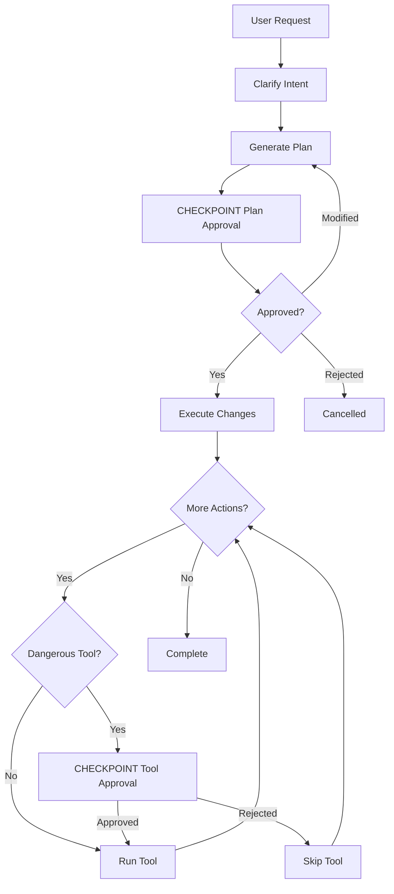

# Coding Workflow: Reference Model

This document explains the coding agent workflow with human-in-the-loop checkpoints, and how the agent loop works for coding tasks.

## How the Agent Loop Works for Coding

### The ReACT Pattern (Reason + Act)

Both your system and Claude Code use the same fundamental pattern:

```
while not done and iterations < max:
    1. LLM reasons: "I need to read main.py"
    2. LLM acts: Calls read_file("main.py")
    3. Tool executes: Returns file content
    4. LLM observes: Sees file content
    5. LLM reasons: "Now I need to modify line 42"
    6. LLM acts: Calls edit_file(...)
    ... repeat until task complete
```

This is called **ReACT** (Reasoning + Acting) and is the standard agent loop pattern.

### Your Agent Loop (agent_loop.py)

```python
def run_loop(messages, tools, execute_tool, config):
    for iteration in range(max_iterations):
        # LLM decides what to do
        response = llm.completion(messages, tools)
        
        if response.tool_calls:
            # Execute tools
            for tool_call in response.tool_calls:
                result = execute_tool(tool_name, tool_args)
                messages.append(tool_result)
            continue  # Loop back to LLM
        
        # No more tools → done
        return response.content
```

**This is identical to Claude Code's pattern.**

### Claude Code's Agent Loop

From Anthropic's engineering blog:

> "The core pattern is beautifully minimal: `while(tool_call) → execute tool → feed results → repeat`. The loop continues as long as the model's response includes tool usage; when Claude produces a plain text response without tool calls, the loop naturally terminates."

**Architecture:**
```
┌─────────────────────────────────────────────┐
│         Claude Code Architecture            │
│                                             │
│  User Input                                 │
│      ↓                                      │
│  Master Loop (nO)                           │
│      ↓                                      │
│  while(tool_calls):                         │
│      LLM → Tool → Result → LLM              │
│      ↓                                      │
│  StreamGen + ToolEngine                     │
│      ↓                                      │
│  Compressor (at 92% context)                │
│      ↓                                      │
│  Final Response                             │
└─────────────────────────────────────────────┘
```

### Key Design Principles (Claude Code)

**From Anthropic:**
- **Single-threaded master loop** - No multi-agent swarms
- **Flat message history** - One simple list of messages
- **Simple tools first** - Regex over embeddings, Markdown over databases
- **Controlled sub-agents** - At most one sub-agent branch at a time
- **Sequential execution** - Coding is dependency-driven

**Your system follows the same principles!**

## Agent Loop: Your System vs Claude Code

| Feature | Your agent_loop.py | Claude Code |
|---------|-------------------|-------------|
| **Core pattern** | ReACT (while tool_calls) | ReACT (while tool_calls) |
| **Threading** | Single-threaded | Single-threaded |
| **Message history** | Flat list | Flat list |
| **Streaming** | ✅ Built-in | ✅ Built-in |
| **Tool approval** | ✅ ShellRunner | ✅ Permission system |
| **Max iterations** | ✅ Configurable (10 default) | ✅ ~25 iterations |
| **Sub-agents** | ✅ SubagentRunner | ✅ dispatch_agent (max 1) |
| **Context management** | Manual | Auto-compress at 92% |

**Your implementation matches Claude Code's architecture closely!**

## Coding-Specific Agent Loop

### What Makes Coding Different

| Aspect | Deep Research | Coding |
|--------|---------------|--------|
| **Tools used** | web_search, web_extract | read_file, edit_file, run_command |
| **Tool sequence** | Independent (parallel research) | Dependent (read → edit → test) |
| **Iterations needed** | 6-15 | 10-30 |
| **Context growth** | Web content (bounded) | Code files (can grow large) |
| **Approval needed** | No (read-only) | Yes (destructive) |

### Typical Coding Agent Loop

```
User: "Add JWT authentication"

Iteration 1:
  LLM: "I need to see the current API structure"
  Tool: read_file("api/routes.py")
  Result: [file content]

Iteration 2:
  LLM: "I need to check if auth directory exists"
  Tool: list_files(".")
  Result: [directory listing]

Iteration 3:
  LLM: "I'll create the auth module"
  Tool: create_file("auth/jwt.py", content=...)
  [CHECKPOINT: File creation - auto-approved]
  Result: Success

Iteration 4:
  LLM: "Now I'll modify the routes"
  Tool: edit_file("api/routes.py", ...)
  [CHECKPOINT: File modification - auto-approved]
  Result: Success

Iteration 5:
  LLM: "Let me test the changes"
  Tool: run_command("pytest tests/")
  [CHECKPOINT: Command approval needed]
  User: "y"
  Result: Tests passed

Iteration 6:
  LLM: "I'll commit the changes"
  Tool: run_command("git commit -m 'Add JWT'")
  [CHECKPOINT: Git approval needed]
  User: "y"
  Result: Success

Iteration 7:
  LLM: "Done. JWT authentication has been added."
  [No tool calls → Loop exits]
```

### Claude Code's Complete Tool Set

**File Operations:**
- `Read` - Read file contents (default ~2000 lines, configurable)
- `Edit` - String replacement editing (old_string → new_string)
- `Write` - Create new files or overwrite existing
- `MultiEdit` - Edit multiple files in one operation
- `Glob` - Find files matching patterns (supports wildcards)

**Search & Navigation:**
- `Grep` - Search for text patterns using ripgrep
- `LS` - List directory contents

**Execution:**
- `Bash` - Execute shell commands in persistent session
- `BashOutput` - Capture bash command output
- `KillShell` - Terminate shell processes

**Development Tools:**
- `WebFetch` - Fetch web content (restricted to mentioned URLs)
- `WebSearch` - Search the web for documentation/context
- `TodoWrite` - Create and manage todo lists
- `TodoRead` - Read todo items
- `NotebookRead` - Read Jupyter notebooks
- `NotebookEdit` - Edit Jupyter notebooks

**Advanced:**
- `Task` / `Agent` - Launch specialized sub-agents (max 1 concurrent)
- `exit_plan_mode` - Exit planning mode
- `SlashCommand` - Execute slash commands (e.g., `/clear`, `/compact`)

**Hook System (10 hook events):**
- `PreToolUse` - Before tool execution (can modify, approve, deny)
- `PostToolUse` - After tool succeeds (can provide feedback)
- `PermissionRequest` - Permission dialog interception
- `UserPromptSubmit` - Before processing user input (can add context, validate)
- `Stop` - When agent wants to stop (can force continue)
- `SubagentStop` - When sub-agent finishes
- `PreCompact` - Before context compression
- `SessionStart` - Session begins/resumes (can load context)
- `SessionEnd` - Session terminates (cleanup)
- `Notification` - Claude Code notifications

**Memory & Context:**
- `CLAUDE.md` - Project memory file (auto-generated)
- Auto-compress at 92% context usage
- Persistent environment variables via hooks

## Claude Code Tool Specifications (Exact Reference)

### File Operations

| Tool | Signature | Behavior |
|------|-----------|----------|
| **Read** | `(file_path: str, offset?: int, limit?: int)` | Read file, default ~2000 lines |
| **Write** | `(file_path: str, content: str)` | Create or overwrite file |
| **Edit** | `(file_path: str, old_string: str, new_string: str, replace_all?: bool)` | String replacement |
| **MultiEdit** | `(edits: [{path, old_string, new_string}])` | Batch edit multiple files |
| **Glob** | `(pattern: str)` | Find files matching pattern |

### Search & Navigation

| Tool | Signature | Behavior |
|------|-----------|----------|
| **Grep** | `(pattern: str, path?: str, flags?: str)` | Ripgrep-powered search |
| **LS** | `(path: str)` | List directory contents |

### Execution

| Tool | Signature | Behavior |
|------|-----------|----------|
| **Bash** | `(command: str, description?: str, timeout?: int, background?: bool)` | Execute in persistent shell |
| **BashOutput** | `(command: str)` | Capture command output only |
| **KillShell** | `()` | Terminate shell process |

### Planning & Memory

| Tool | Signature | Behavior |
|------|-----------|----------|
| **TodoWrite** | `(todos: [{id, content, status, priority}])` | Write/update todo list |
| **TodoRead** | `()` | Read current todos |

### Web & External

| Tool | Signature | Behavior |
|------|-----------|----------|
| **WebFetch** | `(url: str)` | Fetch web content (restricted) |
| **WebSearch** | `(query: str)` | Search web for docs/info |

### Notebooks

| Tool | Signature | Behavior |
|------|-----------|----------|
| **NotebookRead** | `(path: str)` | Read Jupyter notebook |
| **NotebookEdit** | `(path: str, cell_idx: int, content: str)` | Edit notebook cell |

### Agent Control

| Tool | Signature | Behavior |
|------|-----------|----------|
| **Task** / **Agent** | `(agent_type: str, prompt: str)` | Spawn sub-agent (max 1) |
| **exit_plan_mode** | `()` | Exit planning mode |
| **SlashCommand** | `(command: str)` | Execute slash command |

## Your Tool Specifications (Current)

### File Operations (3 tools)

| Tool | Signature | Behavior |
|------|-----------|----------|
| **read_file** | `(path: str, offset?: int, limit?: int)` | ✅ Same as Claude Code Read |
| **write_file** | `(path: str, contents: str)` | ✅ Same as Claude Code Write |
| **str_replace** | `(path: str, old_string: str, new_string: str, replace_all?: bool)` | ✅ Same as Claude Code Edit |

### Search (3 tools)

| Tool | Signature | Behavior |
|------|-----------|----------|
| **grep** | `(pattern: str, path?: str)` | ✅ Similar to Claude Code |
| **glob** | `(pattern: str)` | ✅ Same as Claude Code |
| **list_files** | `(path: str)` | ✅ Same as Claude Code LS |

### Execution (1 tool)

| Tool | Signature | Behavior |
|------|-----------|----------|
| **run_command** | `(command: str, timeout?: int)` | ⚠️ Each subprocess isolated (not persistent) |

### Web (2 tools)

| Tool | Signature | Behavior |
|------|-----------|----------|
| **web_search** | `(query: str, page?: int)` | ✅ Similar to Claude Code |
| **web_extract** | `(url: str)` | ✅ Similar to Claude Code WebFetch |

## What You're Missing (To Reach 24 Tools)

### Critical (Must Add)

1. **TodoWrite** - Planning capability
2. **TodoRead** - Read plans
3. **MultiEdit** - Batch operations

### Important (Should Add)

4. **BashOutput** - Command output capture
5. **KillShell** - Process control
6. **Agent** - Typed sub-agents

### Optional (Nice to Have)

7. **NotebookRead/Edit** - Jupyter support
8. **SlashCommand** - Meta commands
9. **exit_plan_mode** - Mode switching

**Add 1-3 (critical) → 11 tools total → Tool system 9/10**  
**Add 1-6 (critical + important) → 14 tools total → Tool system 10/10**

### Your Tool Set (Current: 8 tools)

**Discovery tools:**
- `read_file` - Read file content
- `list_files` - List directory
- `grep` - Search in files
- `glob` - Pattern matching

**Editing tools:**
- `write_file` - Create/overwrite files
- `str_replace` - Edit with string replacement

**Execution tools:**
- `run_command` - Shell commands (with approval)

**Specialized tools:**
- `web_search` - Research (for context)
- `web_extract` - Read web pages (for docs)

### Gap Analysis: Your Tools vs Claude Code

| Tool Category | Your Tools | Claude Code | Gap |
|---------------|------------|-------------|-----|
| **File ops** | 3 tools | 5 tools | Missing MultiEdit, separate Read/Write |
| **Search** | 2 tools | 2 tools | ✅ Equivalent |
| **Execution** | 1 tool | 3 tools | Missing BashOutput, KillShell |
| **Planning** | 0 tools | 2 tools | Missing TodoWrite/Read |
| **Web** | 2 tools | 2 tools | ✅ Equivalent |
| **Notebooks** | 0 tools | 2 tools | Missing (niche) |
| **Meta** | 0 tools | 2 tools | Missing SlashCommand, exit_plan_mode |
| **Sub-agents** | Generic | Typed | Missing agent types |

**Your total: 8 tools**  
**Claude Code: 24 tools**  
**Critical missing: 5 tools (Todo, MultiEdit, BashOutput, KillShell, Agent types)**  
**Optional: 11 tools (Notebooks, SlashCommands, etc.)**

## Overview

The coding workflow is designed for making code changes safely with multiple approval gates. Unlike deep research (which is read-only), coding makes permanent changes that require user oversight.

## Workflow Diagram



## How Checkpoints Integrate with Agent Loop

### The Complete Flow

```
User Request
    ↓
Clarification Checkpoint (optional)
    ↓
Generate Plan (using agent loop)
    ↓
Plan Approval Checkpoint (required)
    ↓
┌────────────────────────────────────────┐
│      Main Coding Agent Loop            │
│                                        │
│  for iteration in range(max):          │
│      LLM → Tool Decision               │
│              ↓                         │
│      Is tool dangerous?                │
│          ↓ Yes                         │
│      Tool Approval Checkpoint          │
│          ↓ Approved                    │
│      Execute Tool                      │
│          ↓                             │
│      Feed Result to LLM                │
│          ↓                             │
│      Continue or Exit                  │
└────────────────────────────────────────┘
    ↓
Complete
```

### Checkpoints Summary

| Checkpoint | When | Purpose | Required? | In Agent Loop? |
|------------|------|---------|-----------|----------------|
| **Clarification** | Query is ambiguous | Understand requirements | Optional | Before loop |
| **Plan Approval** | After plan generation | Review scope before changes | **Required** | Before loop |
| **Tool Approval** | Before dangerous operations | Control git, deletions, etc. | **Required** | Inside loop |

### Key Insight: Two Types of Checkpoints

**1. Workflow Checkpoints (Outside Agent Loop)**
- Clarification
- Plan approval

These happen BEFORE the agent loop starts executing code.

**2. Tool Checkpoints (Inside Agent Loop)**
- Dangerous command approval (git, rm, etc.)

These happen DURING agent loop execution, per tool call.

### Claude Code's Approach

**Permission System:**
- Write operations → Require approval
- Risky Bash commands → Require approval
- External tools (web) → Require approval
- Users can configure allow/deny rules

**Your Approach:**
- Shell commands → Require approval (`ShellRunner`)
- File operations → Auto-approved (no checkpoint)
- Web tools → Auto-approved (no checkpoint)

## Example Session

### User Request
```
"Add JWT authentication to the API"
```

### Checkpoint 1: Clarification (Optional)

```
System: "Which library would you like to use? Where should tokens be stored?"
User: "Use PyJWT, store tokens in Redis"
```

### Checkpoint 2: Plan Approval (Required)

```
System: "Plan for JWT authentication:

1. Create auth/jwt.py
   - JWT token generation
   - Token validation
   - Refresh token logic

2. Modify api/routes.py
   - Add authentication middleware
   - Protect endpoints

3. Update requirements.txt
   - Add pyjwt==2.8.0
   - Add redis==5.0.0

4. Create tests/test_auth.py
   - Test token generation
   - Test token validation

Approve? (y/n/edit)"

User: "Approve, but skip tests for now"
```

### Execution Phase

```
System: Creating auth/jwt.py... ✓
System: Modifying api/routes.py... ✓
System: Updating requirements.txt... ✓
```

### Checkpoint 3: Tool Approval (Per Dangerous Tool)

```
System: "Run command: git add ."
User: "y"

System: "Run command: git commit -m 'Add JWT authentication'"
User: "y"

System: "Run command: git push origin main"
User: "n"
```

## Workflow Stages

### 1. Clarification Stage

**Purpose:** Understand user intent and gather missing requirements.

**When needed:**
- Query is vague or ambiguous
- Technical choices need to be specified
- Scope needs to be defined

**Example questions:**
- "Which authentication method? (JWT, OAuth, Session-based)"
- "Should this be backward compatible?"
- "Which files should be modified?"

**Implementation:**
```python
def clarify_intent(query: str) -> dict:
    """Detect if clarification is needed and generate questions."""
    if is_ambiguous(query):
        questions = generate_clarification_questions(query)
        return {
            "status": "needs_clarification",
            "questions": questions
        }
    return {"status": "clear", "clarified_query": query}
```

### 2. Planning Stage

**Purpose:** Generate a detailed plan of all changes before execution.

**Plan includes:**
- Files to create
- Files to modify
- Commands to run
- Dependencies to add
- Tests to write

**Output format:**
```json
{
  "files_to_create": [
    {"path": "auth/jwt.py", "purpose": "JWT token handling"}
  ],
  "files_to_modify": [
    {"path": "api/routes.py", "changes": "Add auth middleware"}
  ],
  "commands": [
    "pip install pyjwt redis"
  ],
  "tests": [
    {"path": "tests/test_auth.py", "coverage": "Token generation and validation"}
  ]
}
```

### 3. Plan Approval Checkpoint

**Purpose:** User reviews and approves/modifies the plan before any code is touched.

**User options:**
- **Approve**: Proceed with plan as-is
- **Edit**: Modify specific steps (remove tests, change approach, etc.)
- **Reject**: Cancel the entire operation

**State saved:**
```json
{
  "session_id": "abc123",
  "stage": "awaiting_plan_approval",
  "plan": {...},
  "query": "Add JWT auth"
}
```

### 4. Execution Stage

**Purpose:** Execute the approved plan using the coding agent.

**Uses:**
- `SubagentRunner` for code generation/modification
- Tool calls: `create_file`, `modify_file`, `run_command`
- Your existing `agent_loop.py` infrastructure

**Each tool call goes through:**
1. Agent decides to use tool
2. Check if tool is dangerous
3. If dangerous → Checkpoint (see below)
4. If safe or approved → Execute
5. Continue to next action

### 5. Tool Approval Checkpoint (Per Tool)

**Purpose:** Control dangerous operations that can't be undone.

**Dangerous tools:**
- `run_command` (any shell command)
- Git operations (`git commit`, `git push`, `git reset`)
- File deletion (`rm`, `delete_file`)
- Permission changes (`chmod`, `chown`)

**Your current implementation:**
```python
# shell.py
class ShellRunner:
    def run_command(self, command: str):
        if not self.auto_approve:
            print(f"🔧 Command: {command}")
            response = input("Execute? (y/n): ")
            if response != "y":
                return {"error": "User cancelled"}
        # Execute...
```

## Web vs CLI

### CLI Mode (Current)

**Blocking approval:**
```
Agent: "Run: git commit"
[Process blocks]
User: y [presses enter]
[Process continues]
```

**Benefits:**
- Simple implementation
- Real-time control
- No state management needed

**Limitations:**
- User must be present
- Can't pause overnight
- Single-user only

### Web Mode (Future)

**Non-blocking approval:**
```
Agent: Generates plan → Saves state → Returns to API
[Process exits]

User: Reviews plan in browser (hours later)
User: Clicks "Approve" → API call

Agent: Loads state → Resumes execution
```

**Benefits:**
- Asynchronous (user can leave)
- Multi-user support
- Review via UI

**Implementation:**
```python
# Web API endpoint
@app.post("/coding/start")
async def start_coding(request: str):
    plan = generate_plan(request)
    save_checkpoint(session_id, stage="plan_approval", plan=plan)
    return {"status": "paused", "checkpoint": "plan_approval", "plan": plan}

@app.post("/coding/{session_id}/approve")
async def approve_plan(session_id: str, approved_plan: dict):
    load_checkpoint(session_id)
    execute_plan(approved_plan)
    # Continue until next checkpoint or completion
```

## Comparison: Deep Research vs Coding

| Aspect | Deep Research | Coding |
|--------|---------------|--------|
| **Destructive actions** | No | Yes (file changes, git) |
| **Checkpoints needed** | 0-1 (clarification only) | 2-3 (plan + tools) |
| **Pause/resume** | Optional | Essential |
| **Risk level** | Low (read-only) | High (permanent changes) |
| **Execution time** | 5-30 minutes | Minutes to hours |

## State Management

### Session State Schema

```python
{
  "session_id": "abc123",
  "mode": "coding",
  "stage": "awaiting_plan_approval",  # or "awaiting_tool_approval", "executing", "completed"
  "query": "Add JWT authentication",
  "clarified_query": "Add JWT auth using PyJWT, store in Redis",
  "plan": {
    "files_to_create": [...],
    "files_to_modify": [...],
    "commands": [...]
  },
  "pending_action": {
    "type": "run_command",
    "command": "git commit -m 'Add auth'"
  },
  "completed_actions": [
    {"action": "create_file", "path": "auth/jwt.py", "status": "success"}
  ],
  "created_at": "2026-01-24T10:00:00Z",
  "updated_at": "2026-01-24T10:15:00Z"
}
```

## Implementation Notes

### For CLI (Current System)

Your current system already has:
- ✅ Tool-level approval (`ShellRunner`)
- ⚠️ Missing: Plan-level approval

To add plan approval:
```python
def run_coding_task(request: str):
    # Clarify
    clarified = clarify_if_needed(request)
    
    # Generate plan
    plan = generate_plan(clarified)
    
    # CHECKPOINT: Plan approval
    print(f"\nProposed Plan:\n{format_plan(plan)}")
    approval = input("\nApprove? (y/n/edit): ")
    if approval == "edit":
        plan = edit_plan(plan)
    elif approval != "y":
        return {"status": "cancelled"}
    
    # Execute (with existing tool approval)
    execute_plan(plan)  # ShellRunner handles tool checkpoints
```

### For Web (Future)

Will require:
- State persistence (you have `SessionManager`)
- Async execution (Celery/background jobs)
- Resume logic (you have `resume_deep_research` pattern)

## Security Considerations

**Why plan approval is critical:**

Without it, a malicious or buggy agent could:
- Delete important files
- Commit secrets
- Break production code
- Run dangerous commands

**Why tool approval is critical:**

Even with an approved plan, execution details matter:
- Agent might generate different commands than planned
- Commit messages might contain sensitive info
- Operations might affect unintended files

**Defense-in-depth:** Both plan-level AND tool-level approval provide layered protection.

## Future Enhancements

### Multi-Stage Approval

For complex changes, you might add intermediate checkpoints:

```
Plan → APPROVE → Create files → REVIEW → Modify files → REVIEW → Git operations → APPROVE → Done
```

### Test-Driven Development Integration

```
Plan → APPROVE → Write tests → Run tests → REVIEW → Implement → Run tests → If pass: APPROVE commit
```

### Rollback Support

Track all changes so you can undo:
```
System: "3 files created, 2 modified. Rollback? (y/n)"
User: "y"
System: Reverting changes... ✓
```

## Implementation: How Your System Does It

### Current CLI Implementation

**Step 1: User Request → Agent Loop**

```python
# Your REPL calls agent_loop.py
from common.agent_loop import run_loop, LoopConfig

# System prompt for coding
system_prompt = """You are a coding assistant.
Use tools to read, modify, and test code.
Think step-by-step and verify your changes."""

# Available tools
tools = [
    {"name": "read_file", ...},
    {"name": "edit_file", ...},
    {"name": "run_command", ...},  # Approval required
]

# Execute tool with approval check
def execute_tool(tool_name: str, args: dict) -> dict:
    if tool_name == "run_command":
        return shell_runner.run_command(args["command"])  # Has approval
    else:
        return tool_registry.execute_tool(tool_name, args)

# Run the agent loop
result = run_loop(
    messages=[{"role": "user", "content": "Add JWT auth"}],
    tools=tools,
    execute_tool=execute_tool,
    config=LoopConfig(model="gpt-4o", max_iterations=30),
)
```

**Step 2: Agent Loop Executes**

```python
# From agent_loop.py (your code)
def run_loop(messages, tools, execute_tool, config):
    for iteration in range(config.max_iterations):
        response = llm.completion(messages, tools)
        
        if response.tool_calls:
            # Add assistant message with tool calls
            messages.append({
                "role": "assistant",
                "content": response.content,
                "tool_calls": [...]
            })
            
            # Execute each tool
            for tool_call in response.tool_calls:
                tool_name = tool_call.function.name
                tool_args = json.loads(tool_call.function.arguments)
                
                # This is where approval happens for dangerous tools
                result = execute_tool(tool_name, tool_args)
                
                # Add tool result to messages
                messages.append({
                    "role": "tool",
                    "tool_call_id": tool_call.id,
                    "name": tool_name,
                    "content": json.dumps(result),
                })
            
            continue  # Loop back to LLM
        
        # No tool calls → task complete
        return response.content
```

### Claude Code Implementation (For Comparison)

**Single-threaded master loop:**
```
nO (master loop):
    while tool_calls_present:
        1. Claude generates response with tool calls
        2. ToolEngine executes tools (with permission checks)
        3. Results feed back to Claude
        4. Continue
    
    If context > 92%:
        Compressor summarizes and moves to CLAUDE.md
```

**Your system is functionally identical, just without auto-compression.**

## Comparison: Your System vs Claude Code

| Component | Your System | Claude Code | Status |
|-----------|-------------|-------------|--------|
| **Agent loop** | `agent_loop.py` (210 LOC) | Master loop `nO` | ✅ Same pattern |
| **Tool execution** | `ToolRegistry.execute_tool()` | ToolEngine | ✅ Equivalent |
| **Streaming** | ✅ Built-in | ✅ StreamGen | ✅ Same |
| **Tool approval** | ✅ `ShellRunner` (CLI blocking) | ✅ Permission system (UI) | ✅ Same concept |
| **Sub-agents** | ✅ `SubagentRunner` | ✅ dispatch_agent (max 1) | ✅ Equivalent |
| **Context compression** | ❌ Manual | ✅ Auto at 92% | Different |
| **Planning** | Manual TodoWrite needed | ✅ TodoWrite tool built-in | Different |
| **Memory** | Session files | CLAUDE.md file | Different format |

### What Claude Code Has That You Don't

1. **Auto-context compression** - Compressor triggers at 92% context usage
2. **TodoWrite tool** - Built-in task list management
3. **Diff-based editing** - More granular than your `str_replace`
4. **Real-time steering** - `h2A` queue for mid-task direction changes

### What You Have That Claude Code Doesn't Need

1. **EventEmitter** - Custom event system (Claude uses built-in)
2. **Parallel workers** - For research (not needed for coding)
3. **Tool budget tracking** - Prevent runaway tool usage

## The Answer to Your Question

**Yes, the agent loop for coding IS included in your system.**

It's the same `agent_loop.py` (210 LOC) that powers:
- Deep research workers (parallel)
- Coding tasks (sequential)
- Any other agentic workflow

**The difference between research and coding is not the agent loop itself, but:**
1. **Which tools are available** (web_search vs edit_file)
2. **Which tools require approval** (none vs run_command)
3. **Execution pattern** (parallel workers vs sequential steps)

**Claude Code uses the exact same pattern.** Your architecture is validated by Anthropic's design.

## Recommended Reading

1. **Claude Code Architecture**: https://blog.promptlayer.com/claude-code-behind-the-scenes-of-the-master-agent-loop/
2. **Anthropic's multi-agent research system**: https://www.anthropic.com/engineering/multi-agent-research-system
3. **Claude Agent SDK**: https://www.anthropic.com/engineering/building-agents-with-the-claude-agent-sdk
4. **Your current implementation**: 
   - `src/common/agent_loop.py` (core ReACT loop)
   - `src/anvil/subagents/task_tool.py` (SubagentRunner wrapper)
   - `src/anvil/shell.py` (tool approval)
